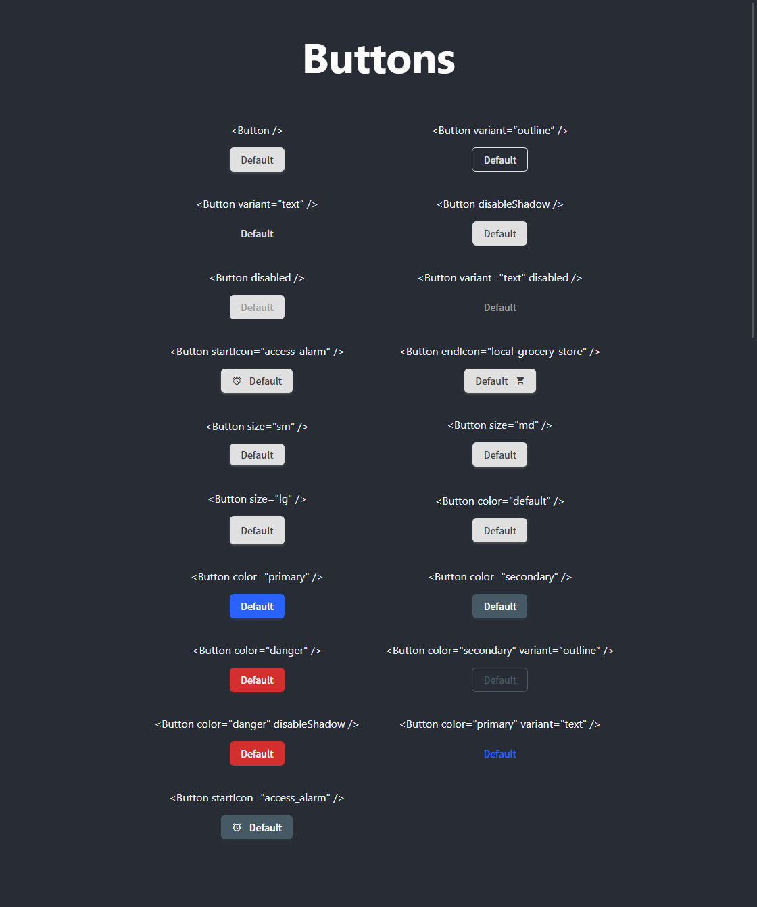

<h1 align="center">Button component</h1>

<div align="center">
   Solution for a challenge from  <a href="http://devchallenges.io" target="_blank">Devchallenges.io</a>.
</div>

<div align="center">
  <h3>
    <a href="https://{your-demo-link.your-domain}">
      Demo
    </a>
    <span> | </span>
    <a href="https://github.com/RauboLuk/Button-component">
      Solution
    </a>
    <span> | </span>
    <a href="https://devchallenges.io/challenges/ohgVTyJCbm5OZyTB2gNY">
      Challenge
    </a>
  </h3>
</div>

<!-- TABLE OF CONTENTS -->

## Table of Contents

- [Overview](#overview)
  - [Built With](#built-with)
- [Features](#features)
- [How to use](#how-to-use)
- [Contact](#contact)
- [Acknowledgements](#acknowledgements)

<!-- OVERVIEW -->

## Overview


ETC: ~13h

### Built With

- [Create React App](https://create-react-app.dev/)
- [hex-rgb](https://github.com/sindresorhus/hex-rgb)
- [Material-UI](https://material-ui.com/)
- [React](https://reactjs.org/)

## Features

This application/site was created as a submission to a [DevChallenges](https://devchallenges.io/challenges) challenge. The [challenge](https://devchallenges.io/challenges/ohgVTyJCbm5OZyTB2gNY) was to build an application to complete the given user stories:

- [x] User story: I can see different button types: default, outline and text
- [x] User story: I can choose to disable box-shadow
- [x] User story: I can choose to disable the button
- [x] User story: I can choose to have an icon on the left or right (Use Google Icon and at least 5 variants)
- [x] User story: I can have different button sizes
- [x] User story: I can have different colors
- [x] User story: When I hover or focus, I can see visual indicators
- [x] User story: I can still access all button attributes
- [x] User story (optional): Show button in a similar way like the design or use Storybook.

## How To Use

To clone and run this application, you'll need [Git](https://git-scm.com) and [Node.js](https://nodejs.org/en/download/) (which comes with [npm](http://npmjs.com)) installed on your computer. From your command line:

```bash
# Clone this repository
$ git clone https://github.com/your-user-name/your-project-name

# Install dependencies
$ npm install

# Run the app
$ npm start
```

## Acknowledgements

- [How can I dynamically load an icon using its snake_case name (React, material-ui)](https://stackoverflow.com/a/56369445)

## Contact

- GitHub [@RauboLuk](https://github.com/RauboLuk)
- Stack Overflow [@RauboLuk](https://stackoverflow.com/users/9185799/rauboluk)
